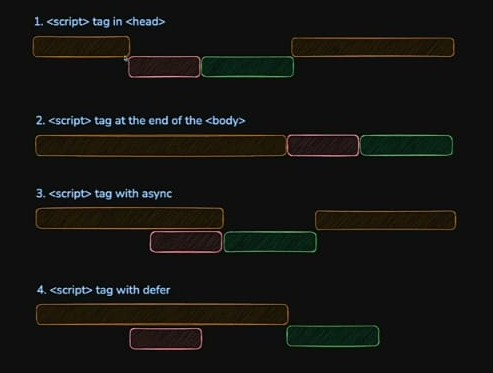

## 6. DOM

### ✅ DOM Tree

The DOM represents the HTML document as a tree structure, where each node is an element, attribute, or text.

```html
<html>
  <body>
    <div id="box">Hello</div>
  </body>
</html>
```

Tree view:

```
html
└── body
    └── div#box
        └── "Hello"
```

### ✅ DOM Selection

- `document.getElementById(id)` → Selects element by id.
- `document.getElementsByClassName(class)` → Selects elements by class.
- `document.getElementsByTagName(tag)` → Selects elements by tag name.
- `document.querySelector(selector)` → Selects the first match for CSS selector.
- `document.querySelectorAll(selector)` → Selects all matches for CSS selector.

```js
const el1 = document.getElementById("box");
const el2 = document.querySelector(".btn");
```

### ✅ DOM Navigation

- `element.parentNode` → Gets the **parent node** (can be any node type).
- `element.parentElement` → Gets the **parent element** only (returns `null` if parent is not an element).
- `element.children` → Returns an **HTMLCollection** of child **elements** (not including text nodes).
- `element.childNodes` → Returns a **NodeList** of **all child nodes** (includes text, comments, etc.).
- `element.firstChild` / `element.lastChild` → First/last **child node** (could be a text node).
- `element.firstElementChild` / `element.lastElementChild` → First/last **element** child.
- `element.nextSibling` / `element.previousSibling` → Next/previous **node** sibling.
- `element.nextElementSibling` / `element.previousElementSibling` → Next/previous **element** sibling.
- `element.hasChildNodes()` → Returns `true` if the element has any child nodes.

```js
const box = document.getElementById("box");

console.log(box.parentNode); // Could be an element or document
console.log(box.parentElement); // Only returns if parent is an element

console.log(box.children); // HTMLCollection of child elements
console.log(box.childNodes); // NodeList of all node types

console.log(box.firstChild); // Might be a text node (e.g. whitespace)
console.log(box.firstElementChild); // First child that is an element

console.log(box.nextSibling); // Could be text or element node
console.log(box.nextElementSibling); // Next sibling that is an element

console.log(box.hasChildNodes()); // true/false
```

- Use `element.children` or `firstElementChild` if you **only care about HTML elements**.
- `childNodes` and `firstChild` often return **text nodes** (like line breaks), which can trip you up.

Great! Here's your **DOM Manipulation** section rewritten in the **same clean style** as the previous upgraded sections — organized, bullet-based, and example included at the end:

### ✅ DOM Manipulation

- `element.textContent` → Get/set **plain text** content.
- `element.innerHTML` → Get/set **HTML markup** inside the element (using `innerHTML` with untrusted content can cause **XSS** vulnerabilities).

- `element.innerText` → Like `textContent`, but respects **CSS styles** (e.g. hides hidden text).
- `element.outerHTML` → Get/set the **entire element** (including itself) as a string of HTML.
- `element.insertAdjacentHTML(position, html)` → Insert HTML relative to the element.
  → Positions: `"beforebegin"`, `"afterbegin"`, `"beforeend"`, `"afterend"`

---

- `element.setAttribute(name, value)` → Set an attribute.
- `element.getAttribute(name)` → Get an attribute.
- `element.hasAttribute(name)` → Returns `true` if the attribute exists.
- `element.removeAttribute(name)` → Remove an attribute.
- `element.attributes` → Access all attributes (as a `NamedNodeMap`).

---

- `element.classList.add(name)` → Add class.
- `element.classList.remove(name)` → Remove class.
- `element.classList.toggle(name)` → Toggle class on/off.
- `element.classList.contains(name)` → Check if class exists.
- `element.style.property` → Set inline style.
- `getComputedStyle(element)` → Read computed CSS from stylesheets.

---

- `element.id` / `element.className` / `element.tagName` → Basic properties.
- `element.hidden = true` → Shortcut to hide (sets `display: none`).
- `element.dataset` → Access `data-*` attributes as a JS object.

```html
<div id="box" class="highlight" data-user-id="123">Welcome</div>
```

```js
const box = document.getElementById("box");

box.textContent = "Updated!";
box.style.color = "red";
box.setAttribute("title", "Tooltip");
box.classList.toggle("highlight");

console.log(box.dataset.userId); // "123"
console.log(getComputedStyle(box).fontSize);
```

### ✅ Creating & Removing Elements

- `document.createElement(tag)` → Create a new element.
- `document.createTextNode(text)` → Create a text node.
- `parent.appendChild(node)` → Append as the last child.
- `parent.insertBefore(newNode, referenceNode)` → Insert before a given node.
- `parent.removeChild(node)` → Remove a child node.
- `parent.replaceChild(newNode, oldNode)` → Replace an existing child with a new one.
- `element.cloneNode(deep)` → Clone an element (`deep = true` copies children too).
- `element.remove()` → Directly remove the element itself (modern shortcut for `parent.removeChild`).

```js
// Create and append
const p = document.createElement("p");
p.textContent = "New Paragraph";
document.body.appendChild(p);

// Insert before
const h1 = document.createElement("h1");
h1.textContent = "Heading";
document.body.insertBefore(h1, p);

// Replace element
const span = document.createElement("span");
span.textContent = "Replaced!";
document.body.replaceChild(span, h1);

// Clone element
const cloned = span.cloneNode(true);
document.body.appendChild(cloned);

// Remove element
span.remove();
```

### ✅ Event Propagation

Event propagation is the process by which an event moves through the DOM in three phases:

1. **Capturing phase** – The event travels from the root element **down** to the target.
2. **Target phase** – The event arrives at the element that triggered it.
3. **Bubbling phase** – The event then bubbles **up** from the target back to the root.

By default, most events bubble, but you can also explicitly use the capturing phase by passing `true` as the third argument to `addEventListener`.

```js
// Capturing phase (third argument is true)
document.getElementById("parent").addEventListener(
  "click",
  () => {
    console.log("Parent clicked (capturing)");
  },
  true
);

// Bubbling phase (default behavior)
document.getElementById("child").addEventListener("click", () => {
  console.log("Child clicked (bubbling)");
});

// Normal event (no propagation logic)
document.getElementById("btn").addEventListener("click", () => {
  alert("Button clicked");
});
```

### ✅ Event Delegation

Event delegation leverages the **bubbling** phase of event propagation. Instead of attaching event listeners to multiple child elements, you attach a single listener to a common parent. When an event bubbles up, you check the `event.target` to determine which child triggered it.

This improves performance and makes it easier to manage dynamically added elements.

```js
const list = document.getElementById("list");

list.addEventListener("click", (e) => {
  if (e.target.tagName === "LI") {
    console.log("Clicked item:", e.target.textContent);
  }
});
```

### ✅ Script Loading

Different ways to load JS into HTML:

1. `<script>` in `<head>` → Blocks rendering until script loads.
2. `<script>` at end of `<body>` → Loads after HTML is parsed (preferred in older practice).
3. `<script async>` → Loads asynchronously, executes immediately when ready (order not guaranteed).
4. `<script defer>` → Loads asynchronously, executes after HTML parsing (order preserved).

Execution flow diagram:



Comparison Table:

| Script Type       | Blocks HTML? | Execution Order | DOM Ready Before Run |
| ----------------- | ------------ | --------------- | -------------------- |
| `<script>` (head) | ✅ Yes       | In order        | ❌ No                |
| `<script>` (end)  | ❌ No        | In order        | ✅ Yes               |
| `<script async>`  | ❌ No        | Unpredictable   | ❌ Not guaranteed    |
| `<script defer>`  | ❌ No        | In order        | ✅ Yes               |
